POSTFLY Business card creator
======
**[Code Institute](https://codeinstitute.net/)  Milestone Project 2: Interactive  Frontend Development**


POSTFLY Business card creator is a site where it is possible to design your own business cards. The focus with this site is to combine knowledge about what it takes to design a business card with what was learned this far about HTML, CSS and JavaScript. The site’s goal is to design your own business card which you can download and request a quotation for.

Demo
======

By clicking this [link](https://daph1986.github.io/Postfly-business-card-creator/) a live demo version will be visible.

<!--  -->

Table of Contents
======

  * [User Experience (UX)](#user-experience-(ux))
  * [Features](#features)
  * [Technologies](#technologies)
  * [Testing & Bugs](#testing-bugs)
  * [Deployment](#deployment)
  * [Credits](#credits)


User Experience (UX)
======
This is meant to be a B2B site which targets visitors  who are in need of business cards and want to design it themselves.

**User stories**

##### Visitor Goals
* Create / design your own business card.
* Be able to choose the paper type and quantity.
* Request a sample kit with papers for if you are not familiar with the paper types.
* Request quotation and download the designed cards.

##### Site Owners Goals
* Provide the service of designing your own business cards in an easy way, without additional designing costs.
* Reduce workload on the prepress (design) staff.
* Expand customer base.

**Strategy**

The design goal is to make a clear, accessible, structured site so that visitors can easily design their own business cards.

**Scope**

The site shows a homepage with an explanation, there the user can either first request a sample kit for the paper types or start designing. On the creator site it allows the user to choose out of three different sizes of business cards, to upload an own photo or logo, to choose a background color, to edit text content, to download the designed card as a pdf file, to choose the paper type, to choose the quantity, to send a request for a quotation for the designed business cards. 

**Structure**

This site is structured as clear as possible, it is easy to see what can be done on the page, on all screen sizes it is clear shouls be done on each part of the site. The design of the card is visible on all screen sizes. This all ensures that the user knows what to do and what to expect.

**Skeleton**

Desktop wireframes <br>

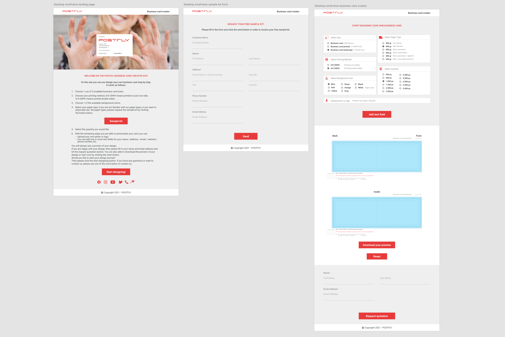

Tablet wireframes <br>

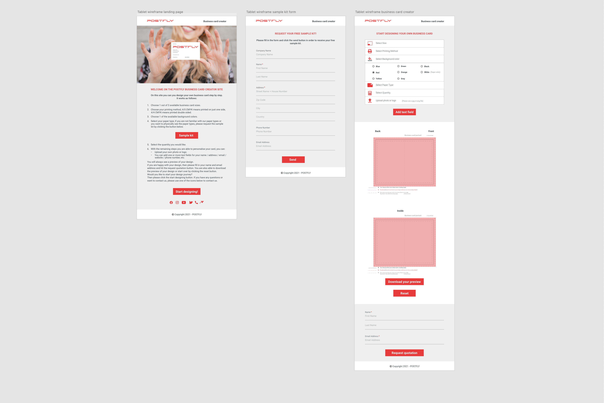

Mobile wireframes<br>

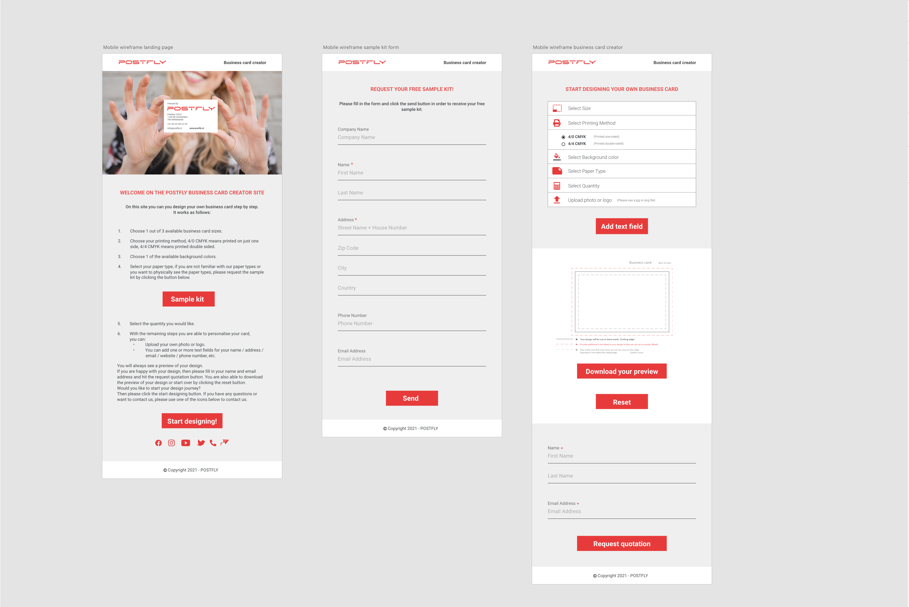


**Surface**

The colors that were used are the existing corporate identity colors, white and an off-white color, which are:

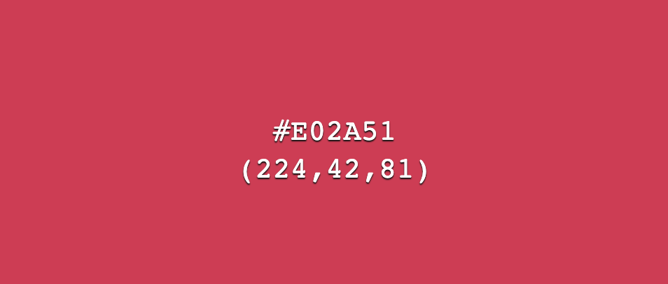 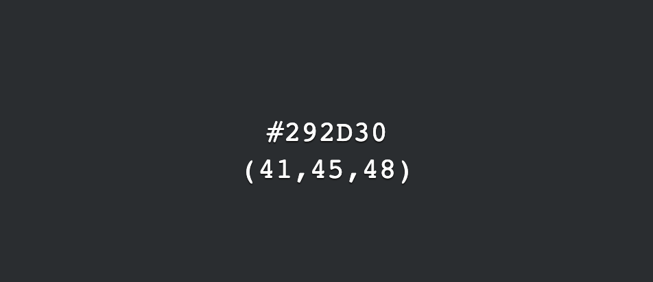 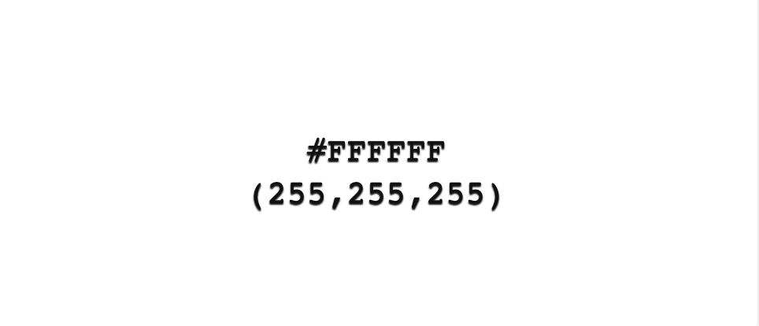 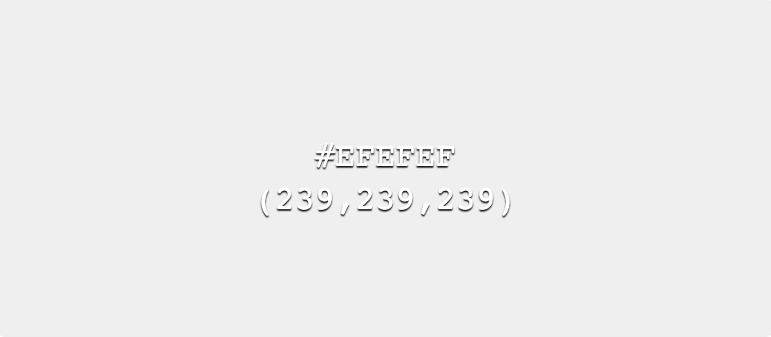


During development the site's layout was restructured a little bit, because this seemed visually or otherwise better.
What was changed is:

1. The color for the red headers and buttons were changed from #E73B3B to #e72f4c and #e02a51 because during testing #E73B3B did not give a good enough contrast.
2. The icon for the website was added, because it would be logical to reffer to the main website of the company.
3. On the sample kit request form a checkbox was added to reduce spam by checking if the user is a robot.
4. The layout for desktop view on the creator.html for the card selectors was changed a bit to make it look more appealing on smaller screens and to make it more logical to follow the steps.
5. The "Select Size" and "Select Printing Method" options were combined to give it a UX friendly experience.


**Fonts & icons**

[Google Fonts](https://fonts.google.com/) was used to embed the Roboto font in the code. Roboto was choosen because this is already in use on the existing POSTFLY site.

For the icons on the homepage [Font Awesome](https://fontawesome.com/) was used and for the creator page the icons of [Materialize](https://materializecss.com/icons.html) were used.

Features
======
The site contains the following features: 
+ send a request for a quotation for the designed business cards
+ choose out of three different sizes of business cards
+ upload an own photo or logo
+ choose a background color
+ edit text content
+ download the designed card as a pdf file
+ choose the paper type
+ choose the quantity

**Features for the future** <br>
The following items can be added: 
+	choose a different color for the frontside and the backside of the card
+	choose the production / delivery time
+	customize the paper size 
+ choose between round or right angles
+	integrate it on the POSTFLY website
+	show costs in advance without having to ask for a quotation
+ set the designed business card through as an order

Technologies
======

**Code languages, libraries and frameworks**
+ HTML5
+ CSS3
+ Materialize 1.0.0
+ JavaScript
+ Fabric
+ EmailJS

**Wireframes**
+ Adobe XD

**Others**
+ Adobe Photoshop: to resize the images.
+ Adobe Illustrator: to adjust the business cards templates.
+ Adobe InDesign to make a favicon
+ VSCode: to write the code in.

Testing & Bugs
======
<!-- The testing has been done on multiple devices and browsers, eventually everything works as intended. Due to the fact that this subject contained more content as expected a separate page has been created.  -->
<!-- For more details on testing and bugs please view this [file](TESTING.md). -->

Deployment
======
To create a live version of the website VSCode was used together with GitHub Pages.
To deploy the website with GitHub pages the following steps were made:
1. Login into the personal GitHub account
2. Go to the repository: https://github.com/Daph1986/Postfly-business-card-creator
3. Click on settings <br>

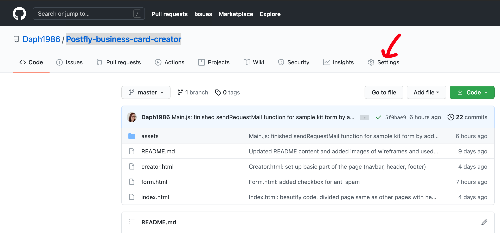

4. Then almost at the bottom the "GitHub Pages" part is found 
5. The branch "master" was selected and saved. <br>

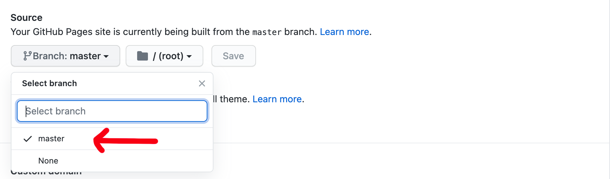

6. After a few minutes the published result was visible <br>

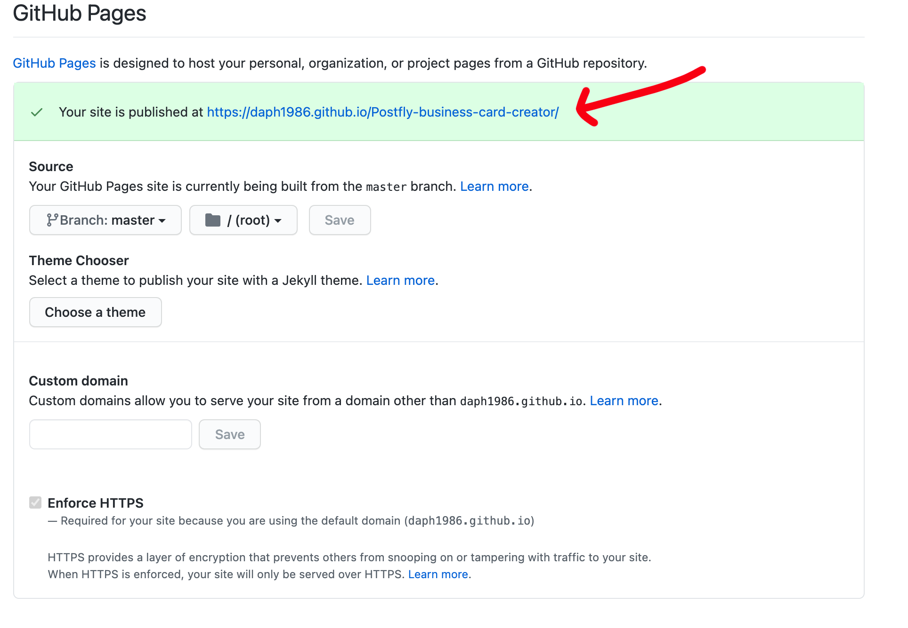

To view the deployed version, the steps underneath can be followed:
1. Log in on [GitHub](https://github.com/) 
2. Find Daph1986's [page](https://github.com/Daph1986)
3. Select repositories
4. Select the Postfly-business-card-creator repository
5. Click on the link on the right side or on the link under "Demo"
By clicking that link the live demo version will be visible. <br>

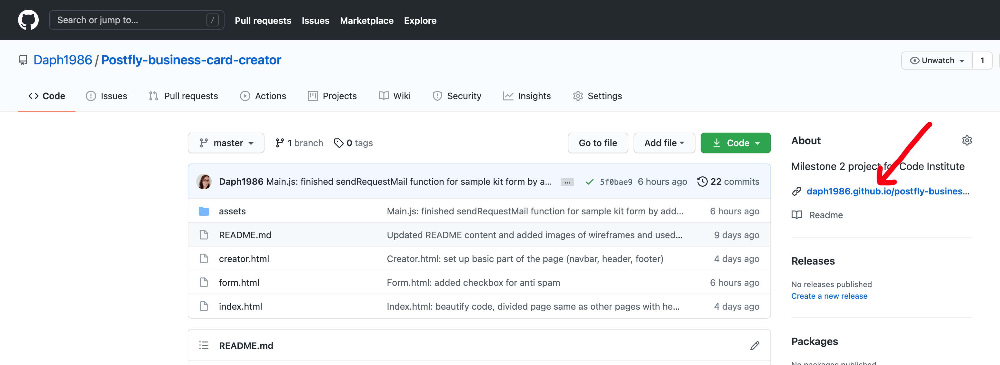
<!-- 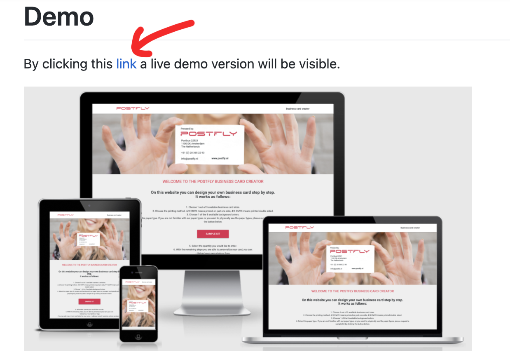 -->

If you would like to run this website locally you can clone this repository in an IDE such as Cloud9 or VSCode.
You can clone it by following the next steps: <br>
1. Log in on [GitHub](https://github.com/) 
2. Find Daph1986's [page](https://github.com/Daph1986)
3. Select repositories
4. Select the Postfly-business-card-creator repository
5. Click on the green "Code" button <br>

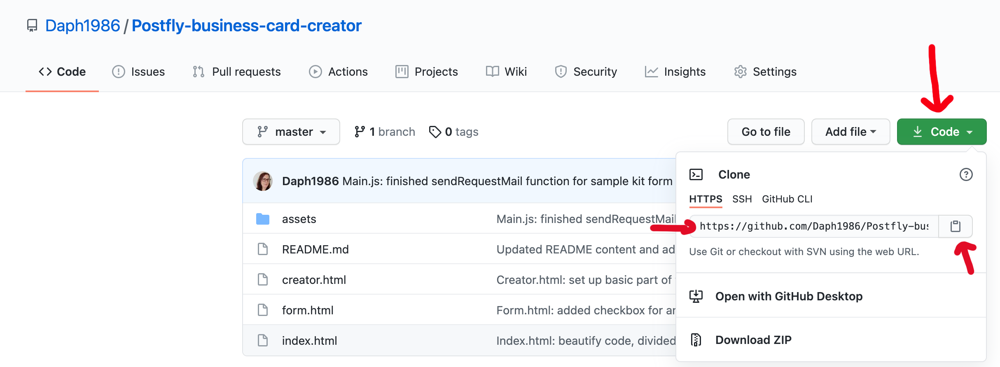 <br>

6. Copy the URL 
7. Open VScode or your preferred IDE, open the file or folder in which you want to use the project and open a CLI terminal
8. Put the following command in the CLI terminal:
``` 
git clone https://github.com/Daph1986/Postfly-business-card-creator.git
``` 
9. Press enter and the clone will be created, it is ready to work on.
```
Cloning into 'Postfly-business-card-creator'...
remote: Enumerating objects: 113, done.
remote: Counting objects: 100% (113/113), done.
remote: Compressing objects: 100% (71/71), done.
remote: Total 113 (delta 34), reused 105 (delta 26), pack-reused 0
Receiving objects: 100% (113/113), 8.54 MiB | 11.13 MiB/s, done.
Resolving deltas: 100% (34/34), done.
```

Credits
======
### Content
All content has been written by myself

### Media 
#### Images:
1. [POSTFLY](http://www.postfly.nl/) 
* the POSTFLY logo provided by my collegue Filip Matthys
* the POSTFLY business cards templates provided by my collegue Filip Matthys, edited by myself
2. [Rawpixel](https://www.rawpixel.com/image/2024655/woman-holding-business-card-png#eyJkYXRhIjp7ImtleXMiOiJidXNpbmVzcyUyMGNhcmRzIiwicGFnZSI6Miwic29ydCI6ImN1cmF0ZWQiLCJjdXJyZW50X3VybCI6Ii9zZWFyY2gvYnVzaW5lc3MlMjBjYXJkcz9zb3J0PWN1cmF0ZWQmcGFnZT0xIiwic2FmZV9zZWFyY2giOjEsInBhZ2VzaXplIjoxMDAsInByZW1pdW0iOiJmcmVlIiwiZnJlZWNjMCI6MCwic2hvd2Nhc2UiOjAsInNvcnRlZEtleXMiOiJidXNpbmVzcyBjYXJkIn0sInBvcyI6MjB9) 
* image that was  used to create the hero image on the landing page
  - Woman holding business card(id-2024655) by cuz.gallery
3. [Toolur](https://compressimage.toolur.com/) was used to compress the hero image
4. [Color-hex](https://www.color-hex.com/) was used to get the images of the colors that were used
#### Code:
<!-- 1. [Autoprefixer CSS](https://autoprefixer.github.io/) to optimize the use of vendor extensions in the CSS code. -->

#### For research when I forgot how things worked again:
1. [Code Institute LMS](https://learn.codeinstitute.net/login)
2. [W3schools](https://www.w3schools.com/)
3. [Stackoverflow](https://stackoverflow.com/)
4. [Materialize](https://materializecss.com/)

### Other
1. [Fabric](http://fabricjs.com/)
As a libary to make the functions work on the canvas
2. [cdnjs](https://cdnjs.com/) to get the js cdn's from
3. [JustSunOne](https://www.youtube.com/watch?v=mghXNWvVGTs) his tutorials about Fabric were followed to get an understanding of how things worked
4. [Our Code World](https://ourcodeworld.com/articles/read/1016/how-to-create-your-own-t-shirt-designer-using-fabricjs-in-javascript) this example was used as an inspiration for the business card creator tool.

### Acknowledgements
+ My mentor from Code Institute, thank you Narender for your time and guidance.
+ My husband, thank you Django for taking care of our son more so I can work on my education and thank you for your patience!
<!-- + Special thanks to my colleagues, my husband, friends and family for their support, tips, and for testing my site. -->
