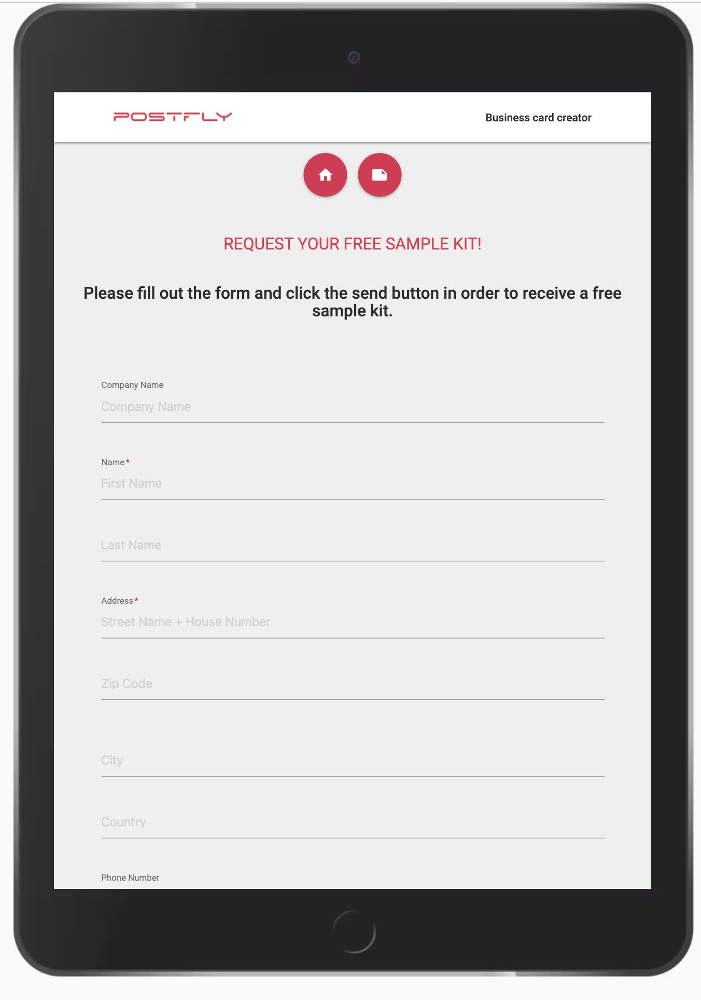
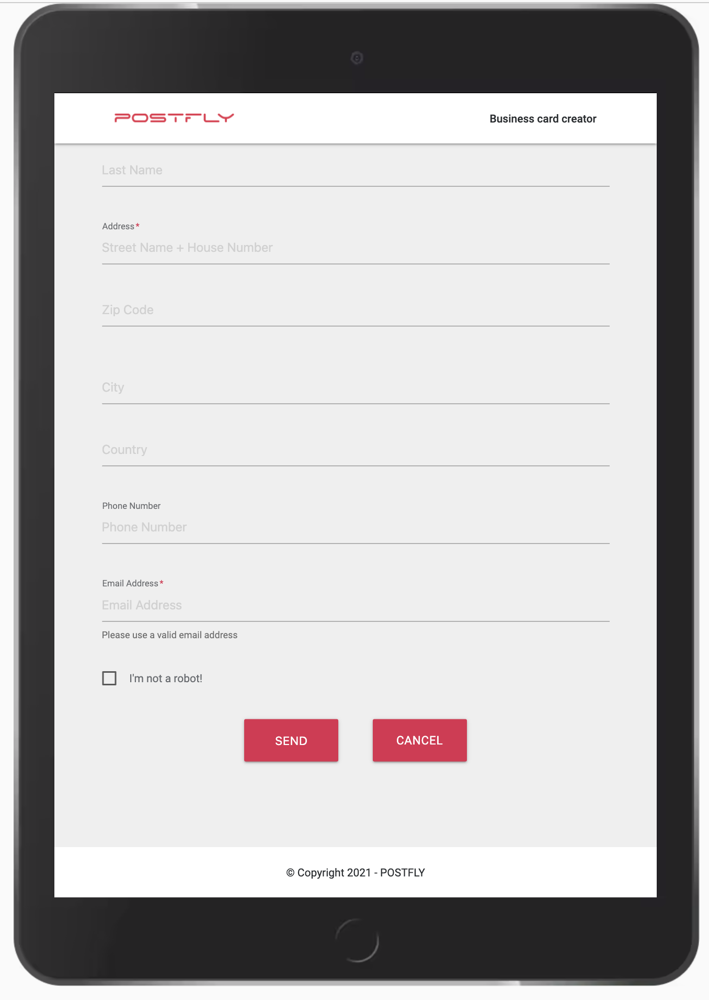
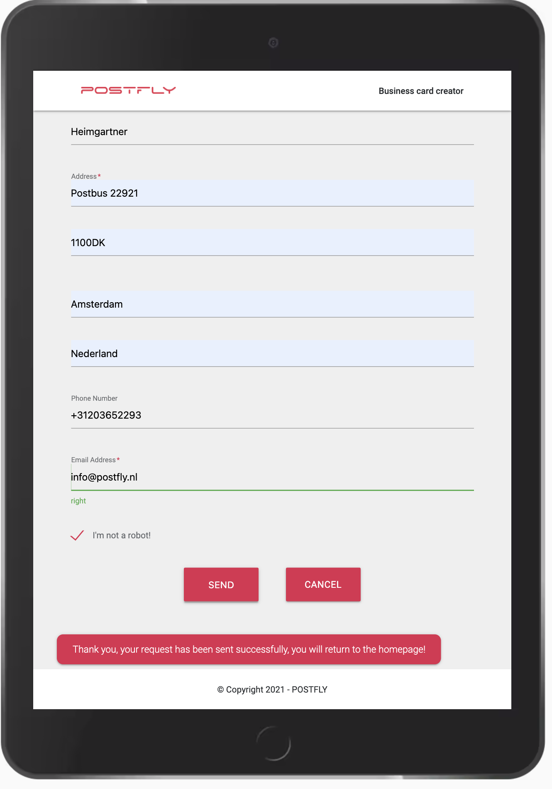
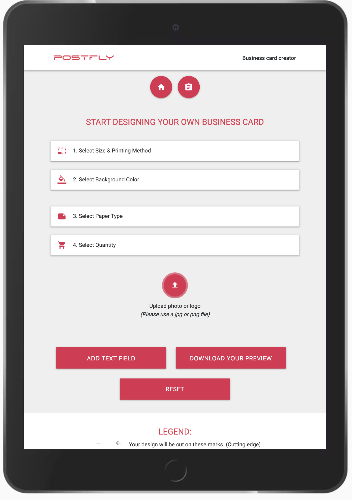
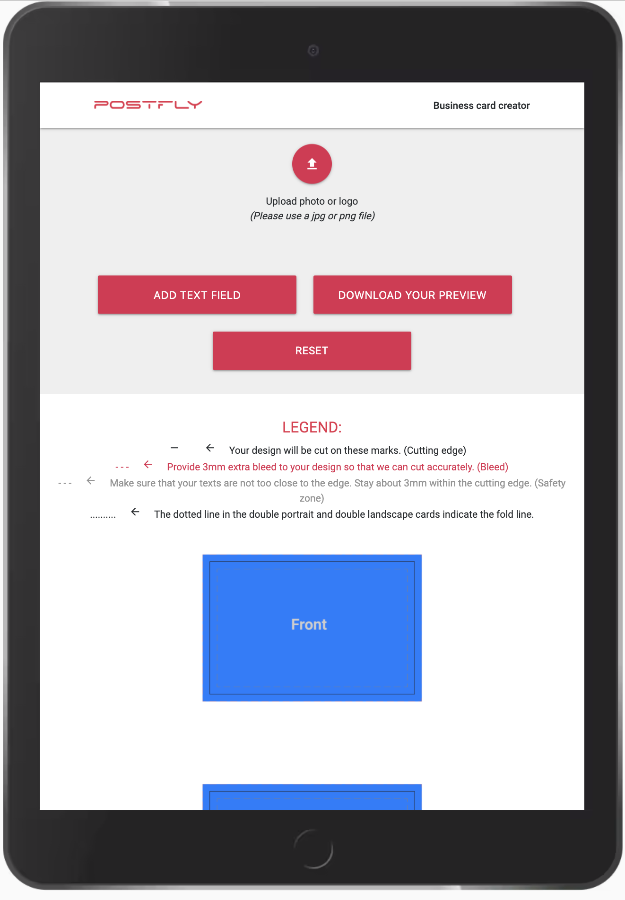
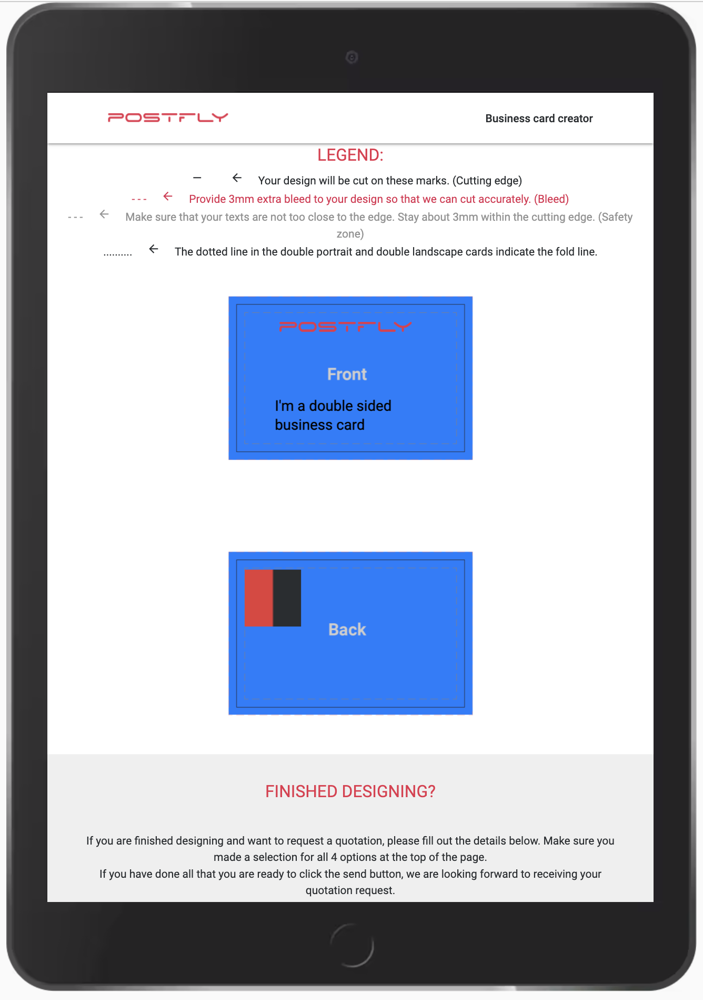
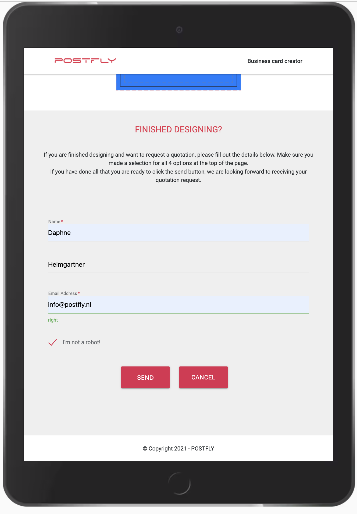
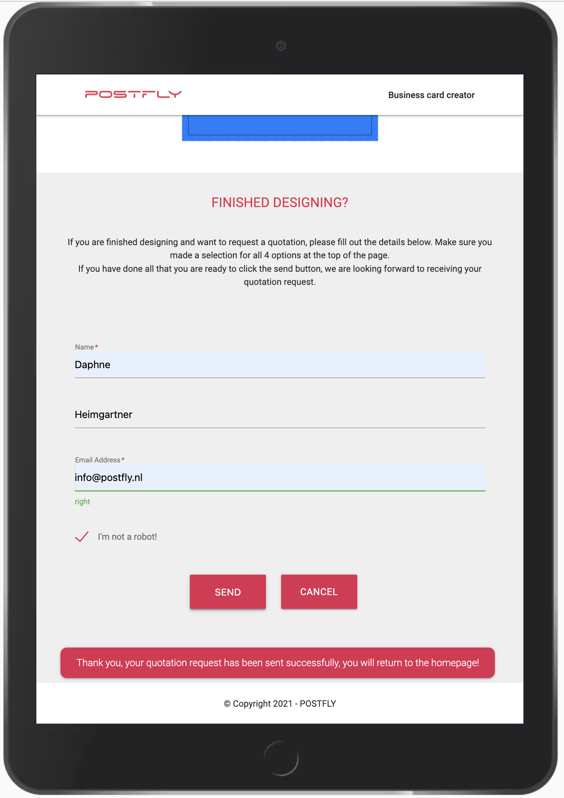
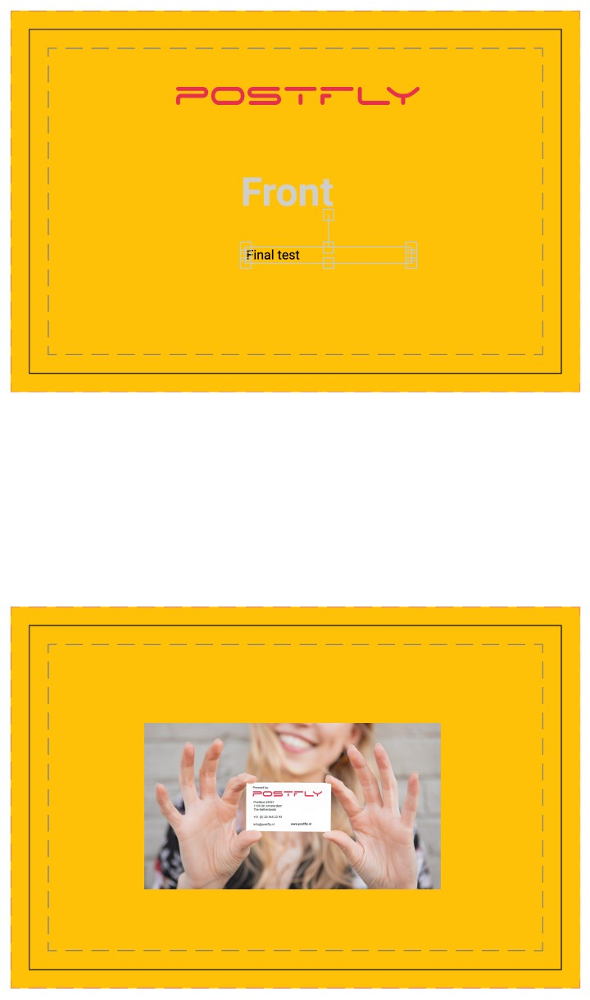
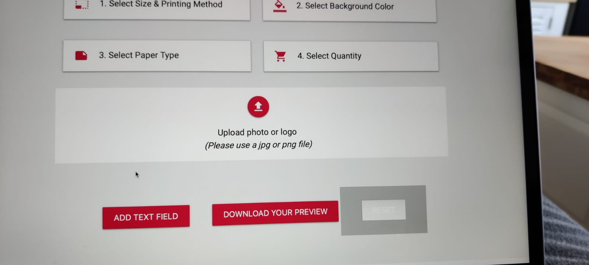

Table of Contents
======

  - [General](#general)
  - [HTML](#html)
  - [CSS](#css)
  - [JavaScript](#javascript)
  - [Lighthouse](#lighthouse)
  - [GTmetrix](#gtmetrix)
  - [Color blindness](#color-blindness)
  - [Slack](#slack)
  - [Colleagues friends family](#colleagues-friends-family)
  - [Bugs](#bugs)


## General

The design goal is to make a clear, accessible, structured site so that visitors can easily design their own business cards. <br>
When landing on the page there is an explanation on how things work: <br>
 <br>
After reading it the user can either request a sample kit or start designing. When the user clicks the sample kit button they will be taken to a form, this form needs to be filled in to get the address to send the sample kit. <br>


 <br> 
After everything is filled out an email is send to, in this case me, with the data needed to send the sample kit through mail. <br>
 <br>
When the user feels ready to start designing they can click the start design button, which will take them to the creator.html page. <br>
 <br>
As a visitor there were multiple steps you would like to take, in the manual tests it was checked if these were achieved.
- Choose out of three different sizes of business cards
- Choose a background color. <br>
 <br>
This can been done in step 1 and 2.
- Choose the paper type.
- Choose the quantity. <br>
 <br>
This can been done in step 3 and 4.
- Upload an own photo or logo.
- Edit text content.
- Download the designed card as a low res jpeg file. <br>


 <br>
The user can click the buttons to achieve this
- Send a request for a quotation for the designed business cards.<br>


 <br>
As with the sample kit form after everything is filled out the request quotation button can be clicked and the user will be informed the request is send succesfully and will be redirected to the homepage.

It can be concluded that all goals have been achieved. <br>
<!-- The site has been tested on the available DevTools for phone and tablet sizes as well as on multiple responsive sizes and it was made sure that it looks good and works well on all. <br>
The site was also tested on multiple devices among others an OnePlus Nord, an iMac (Retina 5K, 27-inch, 2017), a MacBook-Air (Retina M1, 13.3-inch, 2020) and a Samsung Galaxy Tab4 (10.1-inch 2014), everything works as it should. -->

## HTML

HTML code was tested with a [HTML](https://validator.w3.org/#validate_by_input) validator, all the pages were checked.
<!--  -->
<!-- 
It gives only an error for the iframes of the meditations.html: 
 -->

<!-- ```
Text not allowed in element iframe in this context.
``` 
This paragraph text could have just been skipped, but it is left in and the error was ignored, because this is what was learned in the HTML iframes section of the course: 
```
Some very old browsers do not support iframes. It is good practice to add a message to be displayed to users when the iframe will not load. This message goes between the opening and closing iframe tags like this:
```
```
 <iframe src="..."><p>Your browser does not support iframes.</p></iframe>"
```
After consulting with tutor assistance about it, a srcdoc attribute was tested, but then the iframe wouldn't load, so the paragraph text was left the way it was. -->

## CSS

CSS code was tested with a [CSS](https://jigsaw.w3.org/css-validator/validator.html.en#validate_by_input) validator.

<!-- 

As is shown above two errors remain. <br>
First error:
```
Value Error : height Too many values or values are not recognized : intrinsic
``` 
This value was given to keep the image on the moon calendar page from getting pushed together on iPhone, it was one of the two suggestions given my mentor and it works as it should, because the image is pushed together on iPhone anymore.

Second error:
```
text underline offset property does not exist: 0.4em
``` 
Tutor assistance was consulted about it, and it was left this way because this is a functional CSS property, it does what it's supposed to do, it gives a little space between the underline and the active page in the navbar. It was tested on desktop and mobile devices on multiple browsers like Google Chrome, Safari, Microsoft Edge, Firefox and Brave. -->

## JavaScript

JavaScript was tested with a [JavaScript](https://jshint.com/) validator.
<!--  -->

## Lighthouse

All pages have passed through Lighthouse in Chrome DevTools, the results for desktop can found here: 
<!-- 
and these are the results for the mobile versions:

The results are satisfying, so at this moment there is no need for adjustments. -->

## GTmetrix 

<!-- The site was tested with [GTmetrix](https://gtmetrix.com/) by my husband. This is the [first report](https://gtmetrix.com/reports/daph1986.github.io/CTWNdIKZ/). After that the images were compressed to reduce the page loading time. At the end a final test was done, this is the [report](https://gtmetrix.com/reports/daph1986.github.io/XUnAX0rn/) from that test. -->

## Color blindness 

<!-- Color blindness was tested on this [site](https://www.toptal.com/designers/colorfilter/) to ensure you would still be able to read the website when you have different types of color blindness. Here you will find a screenshot off the homepage test, but of course all pages were tested.


 -->

## Slack

<!-- On the 3rd of February the project was placed on [Slack](https://slack.com/intl/en-nl/) and there a few points were brought up by Richard Lovett & Marina Pavlovic, among others the fact that the moon calendar modal could be viewed better when there is a difference in background with the base page and that the contrast for the text and background on the daily life page wasn’t enough. The decision was made to adjust this by changing the background of the modal a bit and to change the background color for the daily life page in order to get a good contrast and keep the consistency in text color. Richard also gave the advice to run the CSS code through an online Autoprefixer CSS. -->

## Colleagues / friends / family

<!-- A lot of different people were asked to check the project to ensure it works on different systems and devices. The website was tested on Samsung Galaxy TabA (10.1-inch 2019), OnePlus 5, Xiaomi Redmi Note 7, Xiaomi Redmi Note 8 Pro, Motorola G9, Motorola G5, Samsung S7, iPhone 6, iPhone 7, iPhone 12 and iPhone 12 Pro Max among others.
My colleague found a bug when you turn your iPhone in landscape mode. 


Research was done and it was tried to solve but didn't work out. It was really frustrating because when you turn iPhones in landscape in the DevTools online this bug doesn't get displayed.
It has to do with the "Notch" which is a safe area on iPhone as explained [here](https://css-tricks.com/the-notch-and-css/). It does this with more sites not only this website.
So, this will be something for the future to solve. <br>
#### Advices given after testing which were followed
1. The reason a preload for jQuery was added, is that a friend of mine, Benny, who works as a senior developer explained that this was a smart thing to do, so that the browser gets a hint of what is coming and can prepare for loading the content. He also suggested that it was better to give the redirect function on the homepage a more self-describing name for clarification and to make the email icon clickable and let it open in the default email.
2. It was my husband, Django, who suggested to put the JavaScript in a separate file. -->

Bugs
======

#### Preview file

The following css code was used to set the preview to center:
```
#center.row .col.s12 {
  float: none;
  display: block;
  margin: auto;
  float: none;
}
```
but as a result when downloading the preview file the prewiew was cut off. <br>
 <br>
This was solved by changing the row into a container and giving it this css code:
```
#center {
  width: 100%;
  height: 440px;
  display: flex;
  justify-content: center;
}
```
But then a strip of the background color on the bottom of preview got visible. <br>

 <br>
This was fixed by combining the excisting js funtions for selectSize, setDimensions and makeCanvasLarge into the selectSize function. 

```
function selectSize(element) {

  const image = document.getElementById('templates');

  if (element.id == 'single-one-sided' && element.checked) {
    image.src = 'assets/images/businesscards_templates/businescard_one_sided.png';

    if (l.matches) {
      canvas.setDimensions({ width: 720, height: 1300 });
      document.getElementById("center").style.height = "495px";}
    else {
      canvas.setDimensions({ width: 320, height: 200 });
      document.getElementById("center").style.height = "220px";}

  } else if (element.id == 'single-double-sided' && element.checked) {
    image.src = 'assets/images/businesscards_templates/businescard_double_sided.png';

    if (l.matches) {
      canvas.setDimensions({ width: 720, height: 1300 });
      document.getElementById("center").style.height = "1220px";}
    else {
      canvas.setDimensions({ width: 320, height: 200 });
      document.getElementById("center").style.height = "535px";}

  } else if (element.id == 'double-portrait-one-sided' && element.checked) {
    image.src = 'assets/images/businesscards_templates/businesscard_double_portrait_one_sided.png';

    if (l.matches) {
      canvas.setDimensions({ width: 720, height: 1300 });
      document.getElementById("center").style.height = "556px";}
    else {
      canvas.setDimensions({ width: 320, height: 200 });
      document.getElementById("center").style.height = "250px";}

  } else if (element.id == 'double-portrait-double-sided' && element.checked) {
    image.src = 'assets/images/businesscards_templates/businesscard_double_portrait_double_sided.png';

    if (l.matches) {
      canvas.setDimensions({ width: 720, height: 1300 });
      document.getElementById("center").style.height = "1305px";}
    else {
      canvas.setDimensions({ width: 320, height: 200 });
      document.getElementById("center").style.height = "580px";}
    
  } else if (element.id == 'double-landscape-one-sided' && element.checked) {
    image.src = 'assets/images/businesscards_templates/businesscard_double_landscape_one_sided.png';
   
    if (l.matches) {
      canvas.setDimensions({ width: 720, height: 1300 });
      document.getElementById("center").style.height = "253px";}
    else {
      canvas.setDimensions({ width: 320, height: 200 });
      document.getElementById("center").style.height = "112px";}

  } else if (element.id == 'double-landscape-double-sided' && element.checked) {
    image.src = 'assets/images/businesscards_templates/businesscard_double_landscape_double_sided.png';
    
    if (l.matches) {
      canvas.setDimensions({ width: 720, height: 1300 });
      document.getElementById("center").style.height = "643px";}
    else {
      canvas.setDimensions({ width: 320, height: 200 });
      document.getElementById("center").style.height = "282px";}
  }
}
```
This ensures that for size the user selects on the screensize the user is on the right div and canvas size is selected.
The preview is good now: <br>
 <br>
One thing remains to be said, when a size selection is made switching from screen size does not resizes the canvas. Only when a new selection is made the proper size will be shown. Of course this can been seen as a bug, but with normal usage this will not happen.

#### Safari button bug

The site was tested on Safari webbrowser among others and there appeared to be something wrong with the add text, download & reset buttons section. <br>
 <br>
The buttons were colorless, the following code was tried to fix it: <br>
creator.html:
```
<button class="waves-effect btn-large btn-postfly button-spacing" type="button" name="action"
  onclick="addTextField()">Add text field</button>
<button class="waves-effect btn-large btn-postfly" type="button" onclick="downloadPreview()">Download your preview</button>
<button><a class="waves-effect btn-large btn-postfly button-spacing" type="reset" value="Reset"
href="creator.html">Reset</a></button>
```
css:
```
button {
  border: none;
}
```
This resulted in the following: <br>
 <br>
After inspecting the type and value seemed to be the problem, so the css styling was removed again and the code for the reset button in creator.html was changed to:
```
<a class="waves-effect btn-large btn-postfly button-spacing" href="creator.html">Reset</a>
```
That fixed the problem.<br>
